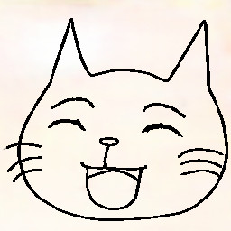

# meow(@meow_noisy)のホームページ

 < meow !

## ■自己紹介
- ひととなり
    - 面白いものを知りたい、面白いものをつくりたいと思っています。
- 職業
    - 役職: ITエンジニア
    - 担当範囲: 機械学習(ML)技術を搭載したシステムの設計、開発、保守・運用・エンハンス
    - [経歴](career.md)
- 趣味
    - [CTFのOSINTカテゴリの問題](/osint_ctf/about_osint_ctf.md)を解くこと

## ■活動
一ヶ月あたりブログ記事1本、スライド1本をアウトプットすることを目標にしています。アウトプットの主なトピックはOSINT CTF、ML、個人開発です。

- 🆕  新着情報
    - 2026/03/22 [技術アウトプット一覧](output.md) を カードレイアウトに変更しました。
    - {{ _best_date }} {{ _type }} [{{ _best_title }}]({{ _best_href }}) を公開しました。
- 📝 技術アウトプット
    - [技術アウトプット一覧](output.md)
    - {{ site.time | date: "%Y/%m/%d" }} の時点でのアウトプット数: {{ _count }}個
- 👨‍💻 個人開発
    - [開発物一覧](/my_products/my_products.md)
- 🎉  受賞
    - [受賞履歴](./awards.md)

## ■その他の個別のトピックページ
- [CTFのOSINTカテゴリとは](/osint_ctf/about_osint_ctf.md)
- [機械学習技術を搭載したシステムの開発](ml_production/ml_prod_portal.md)

## ■SNS、活動内容の発信
- [**X(Twitter)**](http://x.com/meow_noisy)
    - 技術アウトプットの告知用です。
    - DMを開けていますので何かあればこちらからお願いします。
- [**技術ブログ(はてなブログ)**](https://meow-memow.hatenablog.com/)
- [**勉強会の発表スライド(Speaker Deck)**](https://speakerdeck.com/meow_noisy)
- [**GitHub**](https://github.com/meow-noisy)
- [その他のアカウント一覧](sns.md)

