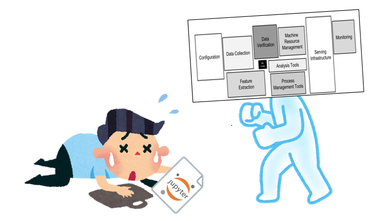

# 機械学習技術を搭載したシステムの開発方法を考える

昨今、機械学習(ML)技術を搭載したサービスが世にたくさん出回っています。そのサービスを支えるシステム(MLシステム)の開発・運用・保守はML特有の理由で大変なことがたくさんあります。現状(2020/01/13)で、MLシステム開発における統一的なデザインパターンや、開発時のベストプラクティスは存在しません。むしろ、**MLOps**(ML & Operations)という課題名で問題がカテゴリ化され、MLシステム開発・運用・保守の課題と解決の方法論が日々、議論が行われています。MLOpsに関する知見の蓄積量は十分とは言えず、まだまだ今後も、さまざまな試行錯誤が報告されることでしょう。

ところで、そのような報告資料は、得てして分散しがちです。すなわち、とある学会、勉強会、発表会、技術ブログ、知見のツイートなどで共有される情報は、一般公開され、誰でも入手できるとはいえ、集約されているとは言い難い状況です。MLOpsの試みが試行錯誤的で知見が一つ一つ貯まっていくようなことを考えると、逐次的に報告されることは、仕方のないことかもしれませんが、何の情報がどこに置いてあるのか把握できないくらい散らかっている状態であるとも言えます。この状態は望ましくはありません。

したがって、このページでは、Web上に公開されているMLOpsの資料の収集をすることを第一義として活動します。また、場合によっては報告されている事項に関して検証したり考察をする予定です。

# 事例ページ
- [機械学習システムの国内運用事例(など)](domestic_example.html)