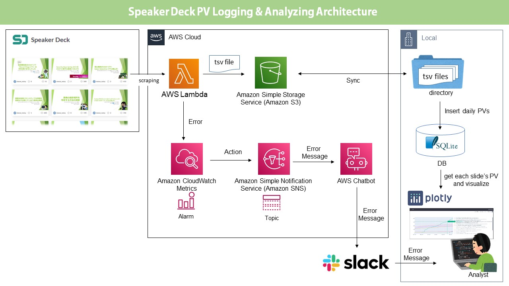
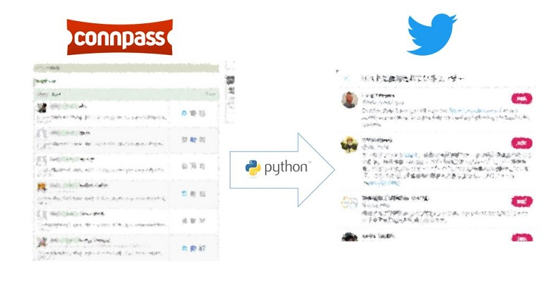
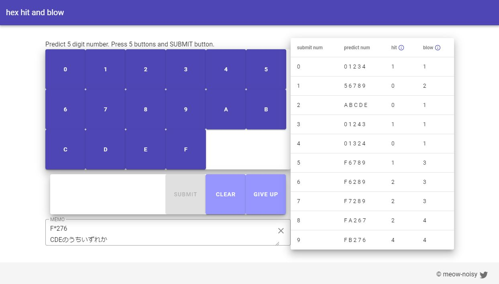
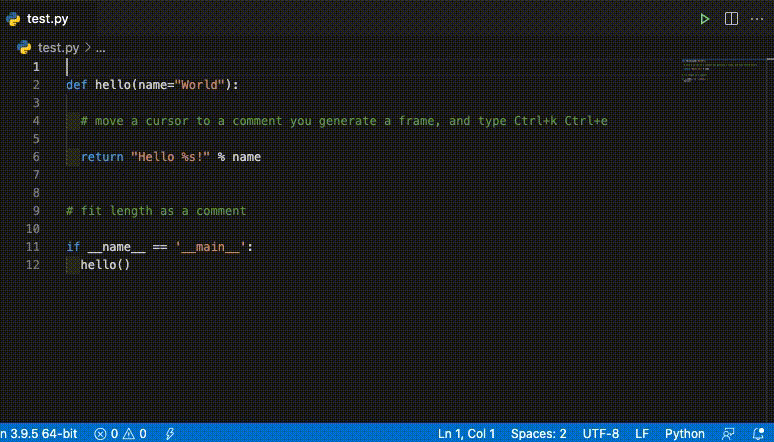

# 過去の開発物
## ■2022年
2022年は2点の開発物があります。

### ◇Webアプリ: Googleマップの位置座標を整形くん(α版)

- URL: [https://meow-noisy.github.io/google_map_gps_formatter/](https://meow-noisy.github.io/google_map_gps_formatter/)
- 説明
    - CTFのOSINTカテゴリで写真の位置座標を答える問題は、フラグ構築が手間です。
        - ここでフラグ構築とは、GoogleマップのURLから座標を抽出して四捨五入してフォーマットへ整形することです。
    - したがって、フォームにGoogleマップを貼り付けると一発でサブミット可能な状態に整形してくれるツールを作りました。
- 使用技術: Vue.js(CSSフレームワーク)
- 開発期間: 約0.2ヶ月

### ◇地理的位置に基づく店舗名の(エセ)AND検索

- 説明
    - 店舗名2つを指定すると距離の近い店舗ペアを列挙するスクリプトです。
    - Googleマップで検索キーを2つ入れても現在見ている範囲内しか提示してくれないので、日本全国の候補をリストアップする実装にしています。
- 使用技術: Python, YOLP
- 開発期間: 約0.25ヶ月
- 解説記事: [地理的位置に基づく店舗名の(エセ)AND検索](https://meow-memow.hatenablog.com/entry/2022/05/01/214751)
- コードリポジトリ(GitHub): [https://github.com/meow-noisy/geocoding_AND_search](https://github.com/meow-noisy/geocoding_AND_search)

## ■2021年
2021年は5点の開発物があります。

### ◇Speaker DeckのPageViewをロギング&可視化する仕組み

- 説明
    - スライド共有サイト『Speaker Deck』はシンプルな使い勝手ですが、PageViewの履歴を可視化する機能を提供していないため、自前でデータ分析・可視化環境を(コストを抑えて)構築したというものです。
    - PVの情報はAWS LambdaでSpeaker Deckから毎日スクレイピングして、ローカルでDBにレコードとして挿入し、それをPythonの可視化ライブラリで可視化するというフローです。
        - Lambdaが失敗した時は、エラーログをSlackに通知するようにしています。
- 使用技術: 
    - Python, Plotly, Beautiful Soup
    - DB: SQLite
    - AWS: S3, Lambda, Chatbot
- 開発期間: 約1.0ヶ月(8/23〜9/19)
- 解説記事: [Speaker DeckのPageViewをロギング&可視化する仕組みをコストを抑えて作った](https://meow-memow.hatenablog.com/entry/2021/09/15/202713)
- コードリポジトリ(GitHub): [https://github.com/meow-noisy/speakerdeck_pv_viewer](https://github.com/meow-noisy/speakerdeck_pv_viewer)

### ◇connpassのイベント参加者のTwitter idを収集し、Twitterリストを作成するPythonスクリプトを書いた

- 説明
    - connpassのイベントの中には、ハッシュタグがない場合があるので、参加者のツイッターリストがあると便利と思い実装しました。
    - 参加者リストの収集用途のみとしても使用可能です。
- 使用技術: 
    - Python, Tweepy, Beautiful Soup
- 開発期間: 約0.65ヶ月(7/5〜7/25)
- 解説記事: [connpassのイベント参加者のTwitter idを収集し、Twitterリストを作成するPythonスクリプトを書いた](https://meow-memow.hatenablog.com/entry/2021/07/25/141047)
- コードリポジトリ(GitHub): [https://github.com/meow-noisy/create_connpass_participants_twitter_list](https://github.com/meow-noisy/create_connpass_participants_twitter_list)

### ◇16進5桁 hit & blow(数当てゲーム)をWeb上で公開

- ゲームのURL: [https://meow-noisy.github.io/hit_and_blow_hex/](https://meow-noisy.github.io/hit_and_blow_hex/)
- 説明
    - JavaScriptを理解していなかったので、Web開発を勉強するために、数当てゲームを実装し公開しました。
    - JSで[プロトタイプ版ページ](https://meow-noisy.github.io/hit_and_blow_hex_proto/)を開発したものの、物足りなかったので、Vue.jsを勉強しVue.jsで実装するようにしました。
    - ホスティングにはGitHub Pagesを使用しました
- 使用技術: Vue.js, Vuetify(CSSフレームワーク)
- 開発期間: 約3.5ヶ月(4/5〜7/25)
- 解説記事:
    -  [Vue.js+Vuetifyをゼロから学習して簡単なブラウザゲームを作った](https://meow-memow.hatenablog.com/entry/2021/08/20/215334)(開発記)
    -  [数当てゲーム『hit and blow』の16進数5桁版は手間が増えて面倒なだけだった](https://meow-noisy.hatenablog.com/entry/2021/08/13/110105)(自分で遊んだ感想)
- コードリポジトリ(GitHub):
    - [本番](https://github.com/meow-noisy/hit_and_blow_hex)
    - [プロトタイプ(JavaScriptのみ)](https://github.com/meow-noisy/hit_and_blow_hex_proto)

### ◇動画から静止したフレームを抽出するPythonパッケージ『pose-scene-picker』の開発
- 説明
    - 動画内で静止しているシーンを切り出して画像化します。スライドを映した講演動画の画像化に使えると思います。
    - もともとの開発動機はGitHub Actionsを使用したCI環境を構築しながらPythonパッケージを開発することでした。
- 使用技術: Python, opencv-python
- 開発期間: 約0.65ヶ月(5/15〜6/4)
- コードリポジトリ(GitHub): [https://github.com/meow-noisy/pose_scene_picker](https://github.com/meow-noisy/pose_scene_picker)
- [PyPI](https://pypi.org/project/pose-scene-picker/)
    - インストール
        - `$ pip install pose-scene-picker`
    - 使い方
        - `$ python -m pose_scene_picker <動画へのパス> <切り出した画像のフォルダ>`

### ◇Visual Studio Codeの拡張機能『comment-frame-generator』の開発

- 説明
    - Pythonのコメントアウトを目立たせるように、枠を生成させます。この時、コメントの文字数に沿うようにしています
- 使用技術: TypeScript
- 開発期間: 約1ヶ月(4/5〜5/9)
- コードリポジトリ(GitHub): [https://github.com/meow-noisy/comment-frame-generator](https://github.com/meow-noisy/comment-frame-generator)
- [Visual Studio Marketplace ページ](https://marketplace.visualstudio.com/items?itemName=meow-noisy.comment-frame-generator)
    - インストール
        - vscodeの拡張機能フォームに"comment-f"と入力すると見つかります
    - 使い方
        1. `.py`ファイルを開き、カーソルラインをコメント行に移動させます。
        2. ショートカットキー`Ctrl+k Ctrl+e`を入力すると枠が付きます

## ■2020年
2020年は1点の開発物があります。

### ◇connpassのキャンセル人数予測をするPythonスクリプト
- 説明: 
    - connpassのイベントでドタキャンが発生するのを数多くみてきたので、事前に参加者数を見積もれたらと思い開発しました。しかし、コロナで勉強会でオンライン開催が増えたことで無断欠席する方が増えたので、予測が当たりにくくなったと思います。
- 使用技術: Python, Beautiful Soup
- 解説記事: [connpassの開催前イベントのキャンセル人数を粗く見積もる方法](https://meow-memow.hatenablog.com/entry/2020/11/02/222557)
- コードリポジトリ(GitHub): [https://github.com/meow-noisy/connpass_estimate_number_of_cancellation](https://github.com/meow-noisy/connpass_estimate_number_of_cancellation)

## ■2019年
2019年は1点の開発物があります。

### ◇animeface-2009の出力結果をpythonで呼び出すための関数とXMLファイル生成器
- 説明: 
    - アニメの顔画像から目、鼻、口のBoundingBoxを推定するanimeface-2009ですが、バインディングはRubyしかなかったため、Pythonで呼べるようにしようとした悪あがきです。
- 使用技術: Python
- 解説記事: [『animeface-2009』をPythonで使うための悪あがき & PASCAL VOC形式のXMLファイルへ出力する関数の実装](https://qiita.com/meow_noisy/items/868a1967d4ef1492db75)
    - ※`Pythonのsubprocessモジュールでシェルを介してRubyを起動し〜`の箇所が、口に含んだ牛乳を吹き出すタイミングです😉
- コードリポジトリ(GitHub): [https://github.com/meow-noisy/animeface_result2xml](https://github.com/meow-noisy/animeface_result2xml)
