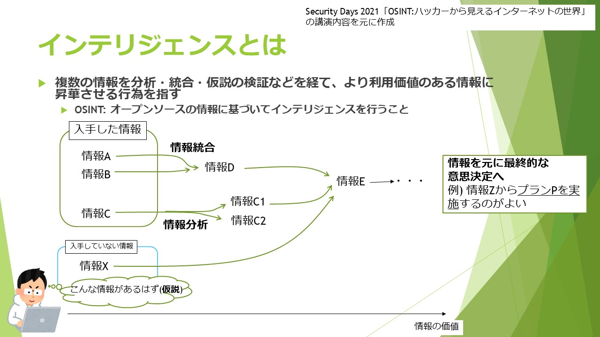

# CTFのOSINTカテゴリの問題とは

OSINTを行うことでフラグを得る形式の問題で構成されたCTFの問題です。  
以下ではキーワードになる単語(CTF, OSINT)に関して説明を行った上で、どのような問題が出題されるかを説明します。

## CTF(Capture The Flag)とは

情報セキュリティの知識や技術を競い合うコンテストです。その性質上、ハッキングのコンテストとも呼ばれることもあります。

お題(例: Webサービスやバイナリファイル)からFlagと呼ばれる特定の文字列を獲得する技術を競い合うのですが、フラグを獲得する手段がサイバー攻撃(例: サーバーへの攻撃、リバースエンジニアリング)を用いることが特徴です。

- 参考文献
    - [CTF（Capture The Flag）とは - IT用語辞典 e-Words](https://e-words.jp/w/CTF.html)
    - [CTF（Capture The Flag）とは？概要・ルール解説｜\[サイバーセキュリティ.com\]](https://cybersecurity-jp.com/column/33780)
    - [キャプチャー・ザ・フラッグ - Wikipedia](https://ja.wikipedia.org/wiki/キャプチャー・ザ・フラッグ)

## OSINT(Open Source Intelligence)とは

まず、Intelligence(インテリジェンス)ですが、こちらは情報を統合・分析・補完・仮説構築を行うことで、利用価値の高い情報に昇華させることを指します。

OSINTは公開情報(Open Source)に基づいてインテリジェンスを行うことです。留意すべき点としては、ここで指す公開情報の中には、意図せずに公開してしまっている、あるいはされてしまっている情報も含まれます。

- 参考文献
    - [日本ハッカー協会代表が伝授「OSINT」の基礎、写真からここまでわかる！ ｜ビジネス+IT](https://www.sbbit.jp/article/bitsp2/70874)
    - [サイバー攻撃に使われる「OSINT」とは｜サイバー/デジタルリスクNavi \[コラム\]](https://www.newton-consulting.co.jp/itilnavi/column/osint.html)

## CTFにおけるOSINTの問題

CTFには様々なカテゴリのお題があります。どのようなカテゴリがあるかは[こちらの解説](https://ctf.setodanote.net/rules)が詳しいです。OSINTもそのカテゴリの一種です。

OSINTカテゴリの問題は、SNSなどで公開されている情報やWebサービスから得られる情報を用いてインテリジェンスを行うことでフラグを得るタイプの問題です。

個人的意見ですが、2つの観点で情報セキュリティの知識や技術を試しているように思います。

1. 意図せずに公開してしまっている情報を見つける能力を問う問題
    - 例: gitリポジトリの過去のコミット内に含まれている機微情報を探す。
2. インテリジェンスの能力を問う問題
    - 例: 写真の撮影場所を特定する。

OSINTカテゴリの問題のみが出題されるCTFは慣例的に`"OSINT CTF"`と呼ばれる印象があります。

## CTFのOSINTカテゴリの問題に興味がある方へ

ここまで読んでいただき、OSINTカテゴリの問題に挑戦してみたいという方向けに、2つCTFを紹介いたします。  
アカウント登録が必要なのでメールアドレスをご用意ください。(どう始めればいいかわからない場合は[私のTwitter](http://twitter.com/meow_noisy)までDMをいただければサポートいたします)

これらのCTFは、第三者による問題の解説記事(write-upといいます)が多く公開されているので、問題に詰まった場合は問題名で調べると解答が見つかります。

- [setodaNote CTF](https://ctf.setodanote.net/)
    - 国内の方が作問・運営されたCTFです。問題文が日本語なので取り掛かりやすいと思います。
- [Cyber Detective CTF](https://ctf.cybersoc.wales/)
    - 初心者向けとされているCTFです。全問OSINTカテゴリで構成されています。問題文は英語ですが、難易度は易しいのでおすすめです。